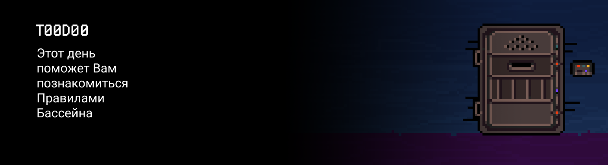

# T00D00

Полезные видеоматериалы ты можешь найти в разделе "Projects (Media)" на Платформе.

## Contents

1. [Chapter I](#chapter-i) \
    1.1. [Readme!](#readme)  
    1.2. [Level 1. Room 1.](#level-1-room-1)
2. [Chapter II](#chapter-ii) \
    2.1. [List 1.](#list-1)  
    2.2. [List 2.](#list-2)  
    2.3. [List 3.](#list-3)  
    2.4. [List 4.](#list-4)  
3. [Chapter III](#chapter-iii) \
    3.1. [Quest 1. Registration.](#quest-1-registration)  
    3.2. [Quest 2. Task with *.](#quest-2-task-with--optional)  
    3.3. [Quest 3. Readme.](#quest-3-readme)
4. [Chapter IV](#chapter-iv) 

# Chapter I

## Readme!

***LOADING… …***

***SUCCESS!***

\>

От разработчиков: \
Здравствуй, дорогой друг! \
Мы предлагаем сыграть тебе в игру. \
Игру, в духе старых добрых текстовых квестовых игр-бродилок с элементами головоломки. \
Каждый Task — это очередное испытание,  обычно некоторое препятствие, которое необходимо преодолеть. \
Лишь тот, кто пройдет все — сможет двинуться дальше. 

Ниже приведено несколько напутствий, они помогут тебе найти свой путь: 
1. Всю дорогу тебя будет сопровождать чувство неопределенности и острого дефицита информации: ЭТО НОРМАЛЬНО. Это часть игры. Не забывай, что информация в репозитории и Google — всегда с тобой. Как и другие игроки. Общайся. Ищи. Собирай. Не бойся ошибиться. 
2. В игре может быть другая игра, в которой будет еще одна. Это нормально. Все как в жизни. Рекурсия — это красиво.
3. Уровни могут сильно отличаться друг от друга. Это нормально. Это часть игры. Нельзя выучить один рецепт и его везде применять. Лишь непрерывно обучаясь и адаптируясь ты сможешь достигнуть цели. 
4. Наша игра — многопользовательская, даже если сначала тебе покажется иначе.
5. Хотя, большую часть пути ты сможешь преодолеть и один.
6. Будь внимателен к источникам информации. Проверяй. Думай. Анализируй. Сравнивай. Не доверяй.
7. Будь внимателен к тексту задания. Думай. Проверяй.
8. Если задание кажется непонятным или невыполнимым — это только так кажется. Просто посиди спокойно, в тишине, или включи любимую музыку. Вернись к заданию через 10-15 минут и перечитай его полностью. 
9. Если п.8 не помог — поищи проводника. Вокруг тебя — много таких же путников, как ты, они с радостью помогут найти тебе выход.
10. Следи за временем! Оно коварно. В день ты должен преодолевать минимум одно испытание!
11. Будь внимателен — и не упусти важное. Внимательно изучай репозиторий!
12. Всегда делай push только в ветку develop! Ветка master будет проигнорирована. Работай в директории src.
13. На твоем пути тебе встретятся разные задания. Те, что помечены звездочкой (*) — подходят только для самых отчаянных. Они с повышенной сложностью и в целом не являются обязательными к выполнению. Но если ты их сделаешь, то получишь дополнительный опыт и знания.
14. Иногда то, что кажется важным — не есть важное. 
15. Помни, в конечном счете, факт преодоления препятствия не так важен, как то, КАК ты его преодолел.
16. Главная цель нашего путешествия — осознать, что такое “КАК”.
17. Отделяй зерна от плевел.
18. Разделяй и властвуй. Декомпозируй. 
19. Думай о главном (о хорошем коде, разумеется). Следуй от общего к частному.
20. Не жульничай, не пытайся обмануть систему и окружающих. В первую очередь ты обманешь себя.
21. Не списывай, а если пользуешься помощью - всегда разбирайся до конца, почему, как и зачем. Иначе твое путешествие не будет иметь никакого смысла.  
22. Почаще заглядывай в папку materials. Там может быть много полезного!
23. Перечитай напутствия несколько раз.

***PRESS ANY KEY TO CONTINUE………………***

## Level 1. Room 1.

***LOADING Level 1…***

***LOADING Room 1…***

\> *Осмотреться*

Ты находишься в неизвестном помещении. Перед тобой — небольшой стол со старым IBM PC-совместимым компьютером. На столе — Pixar-совместимая настольная лампа, дающая теплый, уютный свет, несколько пожелтевших листов бумаги и чашка горячего кофе. \
В противоположной стене ты замечаешь закрытую дверь. По всей видимости, замок электронный, так как ни ручки, ни замка на ней нет.
 
\> *Подергать дверь*

Ручка отсутствует. Дергать нечего.

\> *Выбить дверь*

Больно. И никакого другого эффекта.

\> *Сесть за стол*

Ты сидишь за столом. И что дальше? \
Но, по крайней мере тут не больно.

\> *Выпить кофе*

А вообще, не так уж и плохо!

\> *Выпить кофе*

А вообще, не так уж и плохо!

\> *Выпить кофе*

А вообще, не так уж и плохо!

\> *Выпить кофе*

Кофе закончился.

\> *Посмотреть на стол*

Листы бумаги, ничего необычного. Много текста. \
На одном листе текста мало, он и привлек внимание:

/***Включи компьютер***/

\> *Включить компьютер*

Долго искать кнопку включения не приходится — это большой аналоговый переключатель. Машина зажужжала и показала экран с мигающим курсором.

\> *Поискать мышь*

Мыши нет.

\> *Поискать окна*

Окон нет. Только дверь. На экране окон тоже нет...

\> *Нажать Enter*

Курсор переместился на следующую строку.

\> *Ждать*

Ничего не происходит.

\> *Ждать*

Ничего не происходит.

\> *Посмотреть на стол*

Листы бумаги, ничего необычного. Много текста. \
Под прочитанным листом есть другие.

\> *Читать листы.*

***LOADING...***

# Chapter II

## List 1.

>История Linux начинается в 1991 году, когда финский аспирант программист Линус Торвальдс стал разрабатывать ядро операционной системы для своего компьютера. 
>
>Свои наработки он выложил на общедоступном сервере, и это стало ключевым событием в истории Linux. Сначала десятки, потом сотни и тысячи разработчиков поддержали его проект — общими усилиями на свет появилась полноценная операционная система.
>
>На Linux значительно повлияла система Unix, это заметно даже по названию. Первая официальная версия Linux 1.0 вышла в 1994 году. С самого начала и по сей день Linux распространяется как свободное программное обеспечение с лицензией GPL. Это значит, что исходный код операционной системы может увидеть любой пользователь — и не только увидеть, но и доработать его. Единственное условие — измененный, модифицированный код должен быть также доступен всем и распространяться по лицензии GPL. Это важно, так как дает возможность разработчикам использовать код и в то же время не бояться проблем из-за авторских прав.

Дальше большое пятно от кофе.

\> *Читать следующий лист*

***LOADING...***

## List 2.

Лист зажеван принтером. По всей видимости, матричным.

>3. Сначала Торвальдс хотел назвать свое детище Freax (гибрид слов free, freak и буквы Х, обозначающей принадлежность к Unix-системам), но системный администратор, который выделил ему место на сервере для распространения операционной системы, назвал каталог Linux;
>4. Эмблему Linux выбирали долго, в итоге остановились на пингвине Tux. В своей книге Just for Fun Торвальдс пишет, что пингвина как эмблему он выбрал из-за того, что однажды в зоопарке (дело было в Австралии в 1993 году) его клюнул пингвин;
>5. Linux – абсолютный чемпион по числу установок среди операционных систем общего назначения. Она стоит практически везде: на всех суперкомпьютерах из мирового рейтинга топ-500, на Android-телефонах, на «хромбуках», на встраиваемых устройствах всех видов, на электронных книгах, в смарт-телевизорах и много где еще;
>6. Ядро Linux написано на языке C;
>7. Ядро Linux версии 1.0.0 было выпущено в объеме 176250 строк кода. В настоящий момент ядро Linux состоит более чем из 10 миллионов строк кода;

\> *Читать следующий лист*

***LOADING...***

## List 3.

>Bourne shell (часто sh по имени исполняемого файла) — ранняя командная оболочка UNIX, разработанная Стивеном Борном из Bell Labs и выпущенная в составе 7-го издания операционной системы UNIX (1978). Данная оболочка является де-факто стандартом и доступна почти в любом дистрибутиве *nix. 
>
>Название «bash» является акронимом от англ. Bourne-again-shell («ещё-одна-командная-оболочка-Борна») и представляет собой игру слов: Bourne-shell — одна из популярных разновидностей командной оболочки для UNIX (sh), автором которой является Стивен Борн, усовершенствована в 1987 году Брайаном Фоксом. Фамилия Bourne (Борн) перекликается с английским словом born, означающим «родившийся», отсюда: рождённая-вновь-командная оболочка.

\> *Читать следующий лист*

***LOADING…***

## List 4.

>Git — распределённая система управления версиями. Проект был создан Линусом Торвальдсом для управления разработкой ядра Linux, первая версия выпущена 7 апреля 2005 года. Позже передал его поддержку Джунио Хамано.
>
>На сегодняшний день — де-факто стандарт среди инструментов командной работы программистов. 
>
>Программа является свободной и выпущена под лицензией GNU GPL версии 2. По умолчанию используется TCP порт 9418.
>
>Разработка ядра Linux велась на проприетарной системе BitKeeper, которую автор, — Ларри Маквой, сам разработчик Linux, — предоставил проекту по бесплатной лицензии. Разработчики, высококлассные программисты, написали несколько утилит, и для одной Эндрю Триджелл произвёл реверс-инжиниринг формата передачи данных BitKeeper. В ответ Маквой обвинил разработчиков в нарушении соглашения и отозвал лицензию, и Торвальдс взялся за новую систему: ни одна из открытых систем не позволяла тысячам программистов кооперировать свои усилия (тот же конфликт привёл к написанию Mercurial). Идеология была проста: взять подход CVS и перевернуть с ног на голову, и заодно добавить надёжности.
>
>Начальная разработка велась меньше, чем неделю: 3 апреля 2005 года разработка началась, и уже 7 апреля код Git управлялся неготовой системой. 16 июня Linux был переведён на Git, а 25 июля Торвальдс отказался от обязанностей ведущего разработчика Git.
>
>Торвальдс так саркастически отозвался о выбранном им названии git (что на английском сленге означает «мерзавец»):  “I'm an egotistical bastard, so I name all my projects after myself. First Linux, now git.”

\> *Читать следующий лист*

***LOADING…***

# Chapter III

## Quest 1. Registration.

Посмотреть на экран
На экране пустой терминал и приглашение к действию.

\> Создать аккаунт на GitHub

_**== Получен Quest 1. Зарегистрироваться на GitHub. Создать учётную запись (или подтвердить существующую). ==**_

***LOADING…***

## Quest 2. Task with * (optional).

Посмотреть на экран
Звук вентилятора, мигает светодиод ноутбука. На табличке пометка с символом *.

\> Если у тебя есть компьютер — подготовить окружение

_**== Получен Quest 2. При наличии компьютера: скачать и установить (или подготовить для установки) PostgreSQL, JetBrains Rider, Android Studio и Visual Studio Code. ==**_

***LOADING…***

## Quest 3. Readme.

Открыть директорию src/git_for_human
Внутри лежит файл readme.txt, помеченный как важный.

\> Прочитать файл внимательно

_**== Получен Quest 3. Внимательно прочитать файл src/git_for_human/readme.txt. ==**_

***LOADING...***

# Chapter IV

\> *Готово*

Не знаю, что ты там сделал, но это сработало. Дверь открылась. \
Хотя меня не покидает чувство, что особой твоей заслуги в том не было... Будь осторожен. Никогда не знаешь, что у ИИ на уме. Особенно неправильно сконфигурированного и без половины необходимых модулей.

***LOADING...***
